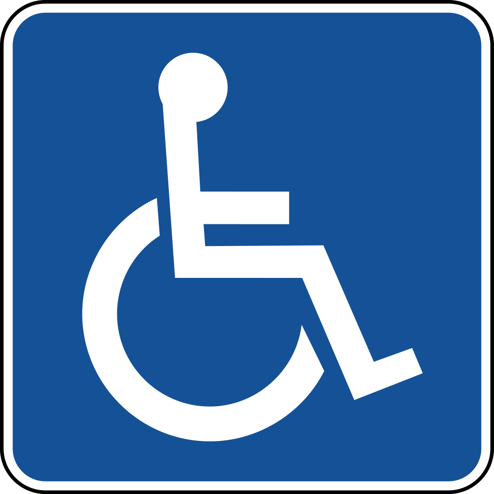
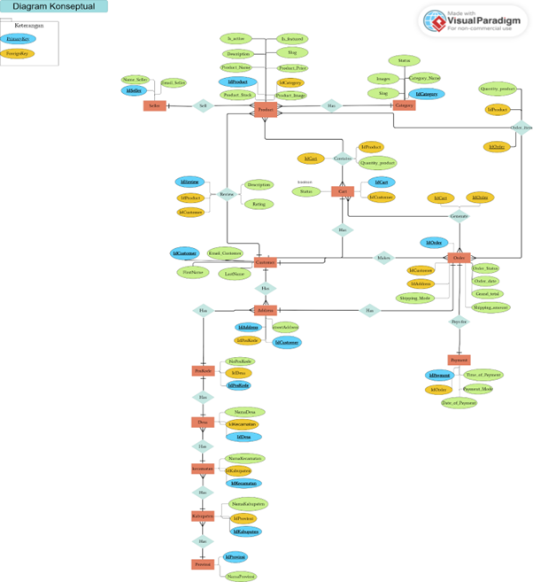
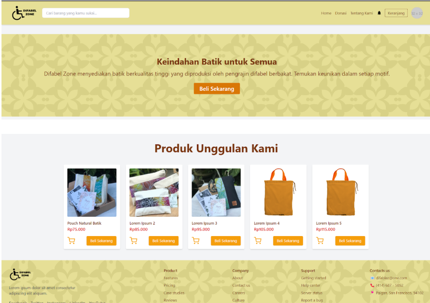

  

## About DifabelZone
DifabelZone is an e-commerce platform that sells creative products made by the disabled community, managed directly by community leaders. We support the empowerment and economic independence of people with disabilities by introducing their work to a wider market.

## Key Features
- Creative Products: Provides unique products made by the disabled community.
- Community Managed: Each product is managed directly by the head of the disabled community.
- Economic Empowerment: Supporting economic independence for people with disabilities.
- E-commerce User-Friendly: Easy-to-use platform to buy products from various disabled communities.

## ER-Diagram

  

## UI/UX

  

## Contributing
Thank you for considering contributing to DifabelZone! We welcome contributions that align with our mission to make the platform more accessible and impactful.

- [Hendro](https://github.com/hendrowunga)  
- [Bobby](https://github.com/stepanussaruran)  
- [Galuh](https://github.com/GaluhSuni)  
- [Stepanus](https://github.com/stepanussaruran)

